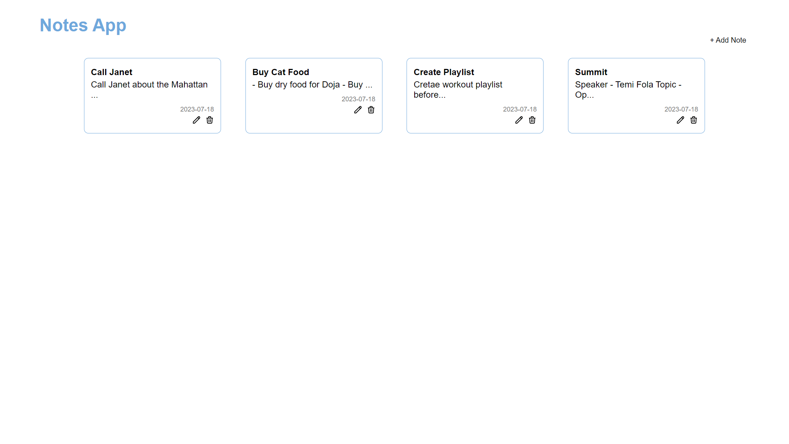

# notes-app

This Project was built using vue2

## Table of contents

- [Overview](#overview)
  - [The challenge](#the-challenge)
  - [Screenshot](#screenshot)
  - [Links](#links)
- [My process](#my-process)
  - [Built with](#built-with)
  - [What I learned](#what-i-learned)
- [Author](#author)
- [Project setup](#setup)
  - [Compile-Dev](#compiles-and-hot-reloads-for-development)
  - [Compile-Prod](#compiles-and-minifies-for-production)
  - [Lint](#lints-and-fixes-files)

## Overview

### The challenge

Users should be able to:

- See a list of notes (if any) and an option to add a new one
- Create a new note
- Delte a note and should get a prompt to confirm delete
- Edit existing Note
- Receive data from local storage of the user on page load

### Screenshot



### Links

- Live Site URL: [https://notes-app-7f44.vercel.app/](https://notes-app-7f44.vercel.app/)

## My process

### Built with

- Vue 2
- CSS custom properties
- Flexbox
- Mobile-first workflow

### What I learned

- Vue and it's syntax

## Author

- Website - [Eseoghene Alli](https://esealli.github.io/)

## Project setup

```
yarn install
```

### Compiles and hot-reloads for development

```
yarn serve
```

### Compiles and minifies for production

```
yarn build
```

### Lints and fixes files

```
yarn lint
```
